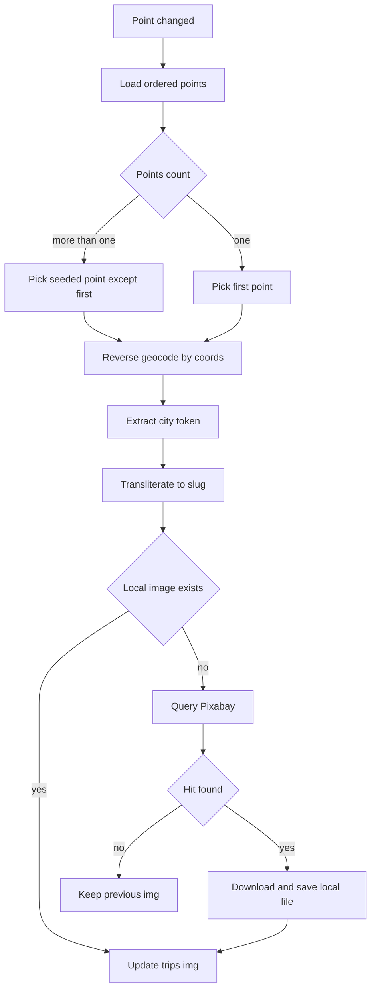

# План интеграции автообложек маршрутов через локальные файлы и Pixabay

## 1. Цель

Реализовать backend-механику, при которой поле `trips.img` автоматически заполняется релевантной картинкой маршрута:

- сначала ищем локально в `apps/web/public/assets/images`
- если локально нет — берем из Pixabay, сохраняем локально
- записываем web-путь в БД

UI в `apps/web/src/entities/trip/ui/TripCard.tsx` не ломаем: карточка продолжает брать `trip.img` или fallback.

---

## 2. Текущий контекст проекта

- В схеме есть поле `img` в таблице `trips`.
- Точки маршрута хранятся в `route_points` с координатами `lat/lon`.
- В проекте уже есть reverse-geocoding: `GeosearchService.reverse`.
- API уже читает `.env` из корня монорепы через `ConfigModule.forRoot envFilePath ../../.env`.

Следовательно, извлечение города нужно строить от координат, а не от `address/title`, так как они ненадежны.

---

## 3. Архитектурное решение

### 3.1 Новый доменный сервис

Добавить отдельный сервис в API, например `TripImageService`, который отвечает за полный lifecycle подбора обложки:

1. выбор точки по правилу
2. определение города через reverse geocoding
3. транслитерация города в slug
4. поиск локального файла
5. поиск/скачивание из Pixabay при отсутствии локального
6. обновление `trips.img`

Это изолирует логику и не раздувает `PointsService`.

### 3.2 Где вызывать пересчет

Пересчет запускать после изменений состава/содержимого точек:

- `PointsService.create`
- `PointsService.update`
- `PointsService.remove`

`PointsService.reorder` исключаем, потому что перестановка порядка точек не меняет геоданные и не требует пересчета обложки.

Вызов делать в fire-and-forget безопасном режиме либо await с мягкой обработкой ошибок, чтобы поломка внешнего API не роняла основной CRUD точек.

### 3.3 Правило выбора точки

- Если точек больше одной — выбрать случайную точку из диапазона `[1..n-1]` (кроме первой).
- Если точка одна — взять первую.

Чтобы картинка не «прыгала» при каждом апдейте, вместо настоящего random использовать детерминированный seeded выбор по `tripId`.

---

## 4. Пайплайн подбора изображения

---

## 5. Нормализация города и slug

### 5.1 Извлечение города

Из результата reverse geocoding использовать каскад:

1. city
2. town
3. village
4. settlement/suburb
5. state_district/state

Если каскад пустой — не трогать текущее `trips.img`.

### 5.2 Транслитерация

Нужен утилитарный трансформер, например:

- `Сочи -> sochi`
- `Нижний Новгород -> nizhniy-novgorod`

Правила:

- кириллица → латиница
- lowercase
- пробелы/знаки → `-`
- очистка дублей `-`

---

## 6. Локальный поиск файлов

Папка: `apps/web/public/assets/images`.

Порядок проверки:

1. `<slug>.webp`
2. `<slug>.avif`
3. `<slug>.jpg`
4. `<slug>.jpeg`
5. `<slug>.png`

Если найдено — в `trips.img` пишем web-путь:

- `/assets/images/<filename>`

Не использовать абсолютные файловые пути ОС в БД.

---

## 7. Интеграция Pixabay

### 7.1 Конфигурация

Ключ хранится в `travel-planner/.env`:

- `PIXABAY_API_KEY=...`

API уже подхватывает корневой `.env`, дополнительного файла не нужно.

### 7.2 Параметры запроса

Базово:

- `q=<city-slug or city-name>`
- `image_type=photo`
- `safesearch=true`
- `per_page=10`
- `orientation=horizontal`

Фильтры нужны, чтобы карточки выглядели единообразно.

### 7.3 Обработка сбоев

- timeout на HTTP
- до 2 повторов при 5xx/timeout
- обработка 429 без падения бизнес-операции
- если результата нет — оставить прежнюю картинку

---

## 8. Скачивание и сохранение файла

### 8.1 Безопасность

Перед сохранением проверять:

- URL только `https`
- `content-type` начинается с `image/`
- ограничение на размер файла

### 8.2 Запись

- сохранять во временный файл
- после успешной записи делать атомарный rename в `<slug>.webp`
- защита от гонок через lock ключ `trip-image:<tripId>` (Redis)

### 8.3 Формат

Можно начать с сохранения оригинального формата как есть и именем `<slug>.<ext>`.
Если нужен строго `.webp`, добавить конвертацию отдельным шагом.

---

## 9. Обновление БД

Обновление `trips.img` должно быть идемпотентным:

- если вычисленный путь совпадает с текущим — пропускаем update
- если не удалось определить новый путь — не затираем существующий

Это снижает лишние записи и риск потерять валидную обложку.

---

## 10. Риски и меры закрытия

1. Город не определяется
- Мера: каскад fallback-полей + не перезаписывать `img` при пустом результате.

2. Картинка постоянно меняется
- Мера: seeded выбор точки по `tripId` вместо true random.

3. Перегруз/квоты Pixabay
- Мера: локальный кеш в файловой системе + retry + graceful degradation.

4. Гонки при параллельных апдейтах
- Мера: Redis lock + атомарная запись файла.

5. Потенциально небезопасные удаленные URL
- Мера: whitelist протокола и проверка MIME.

6. Поломка UI
- Мера: хранить только web-путь `/assets/images/...`; `TripCard` не менять.

---

## 11. Изменения по файлам

Планируемо затронуть:

- `apps/api/src/points/points.service.ts` — вызовы пересчета после CRUD/reorder
- `apps/api/src/points/points.module.ts` — провайдеры/импорты сервиса
- `apps/api/src/trips` — новый сервис для image resolution
- `apps/api/src/geosearch/geosearch.module.ts` — экспорт/импорт при DI необходимости
- `travel-planner/.env.example` — добавить `PIXABAY_API_KEY`

Frontend-файлы менять не требуется.

---

## 12. Тест-план

1. Unit: slug/transliteration
- кириллица, пробелы, дефисы, спецсимволы

2. Unit: point selection
- 1 точка
- >1 точек
- стабильность seeded выбора

3. Unit: local file resolver
- файл найден/не найден
- разные расширения

4. Unit: Pixabay client
- успех
- пустой ответ
- timeout/429/5xx

5. Интеграция: points CRUD
- после create/update/remove/reorder обновляется `trips.img` по правилам

6. Регрессия UI
- карточки продолжают отображаться через `trip.img` и fallback.

---

## 13. Что нужно от вас для реализации

1. Подтвердить, что используем ключ в `travel-planner/.env` как `PIXABAY_API_KEY`.
2. Подтвердить policy запроса Pixabay:
   - только photo
   - safesearch true
   - горизонтальная ориентация
3. Подтвердить стратегию при пустом результате Pixabay:
   - сохраняем старый `trips.img` без изменений.

---

## 14. Критерии готовности

Считаем задачу завершенной, когда:

- при изменении точек у маршрута автоматически устанавливается валидный `trips.img`
- при наличии локального файла Pixabay не вызывается
- при отсутствии локального файла изображение скачивается и кешируется локально
- UI профиля показывает новые обложки без изменений в `TripCard`
- при сбоях внешних сервисов основной функционал точек не ломается
